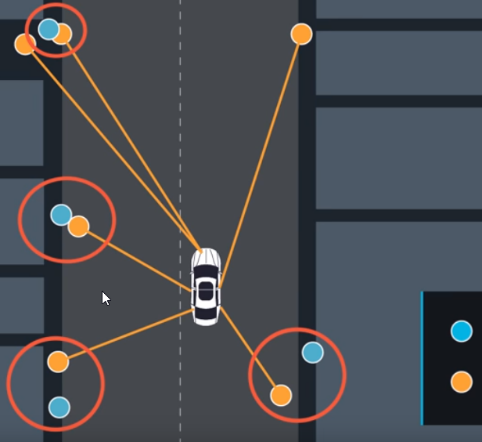
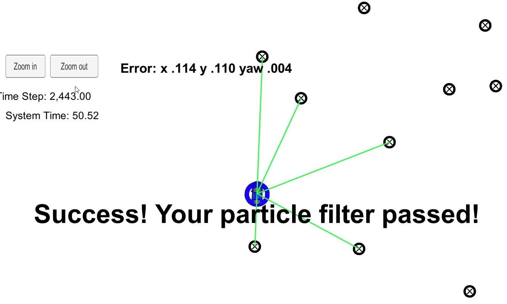

# **Self-Driving Car Engineer Nanodegree** #

# **Term2 – Project3: Particle Filters** #

## **INTRODUCTION** ##

In this project will implement a 2 dimensional particle filter in C++.
The particle filter will be given a map and some initial localization
information (analogous to what a GPS would provide). At each time step
your filter will also get observation and control data. Using
predict/update particle filter algorithms, the location of the car will
be found.

## **PARTICLE FILTER FLOWCHART (UDACITY)** ##

## **INITIALIZATION** ##

The number of particles is chosen empirically (on this case 100 seem
sufficient). All particles were assigned an initial X Y YAW values in
global coordinate system coming from the GPS reading. Sensor Gaussian
noise was added to those values to make particles have different values.

## **PREDICTION STEP** ##

Based on sensor’s velocity and yawrate readings, the particles positions
and yaw are updated:

particles\[i\].x = particles\[i\].x + velocity / yaw\_rate \*
(sin(particles\[i\].theta + yaw\_rate \* delta\_t) -
sin(particles\[i\].theta));

particles\[i\].y = particles\[i\].y + velocity / yaw\_rate \*
(cos(particles\[i\].theta) - cos(particles\[i\].theta + yaw\_rate \*
delta\_t));

particles\[i\].theta = particles\[i\].theta + yaw\_rate \* delta\_t;

After the update noise from a normal distribution is added using the
standard deviation of the measurement instruments.

## **UPDATE STEP** ##

The update step is performed in the ParticleFilter::updateWeights
function. It uses as inputs:

-   sensor\_range

-   landmarks (map is provided with 42 landmarks with location in global
    CS):

> 

-   observations(measurements to each landmark):

> 

-   the standard deviation of those observations

The *Update pseudocode* is as follows:

> *For every particle:*
>
> *For every observation:*
>
> *-transform observation to global CS viewed from the particle*
>
> *For every landmark:*
>
> *-find distance between transformed observation and landmark*
>
> *-use the closest landmark(“assignment”) -&gt; compute multivariate
> gaussian probability*
>
> *-multiply probability*
>
> *-final probability becomes the weight of the particle*

## **RESAMPLE STEP** ##

The only inputs are the weights of all particles. Pick a new set of
particles choosing randomly but using weights, so that the particle with
the higher weights are more likely to be picked.

## **ACCURACY OF SOLUTION** ##

This is performed in the using the pre-built getError function that
compares X Y YAW values w.r.t. ground truth values.

## **SIMULATION RESULTS** ##

The particle model was able to use all 42 landmarks, observations, speed
and yaw rate to stay on track. The error stayed within the allowed
limits.

